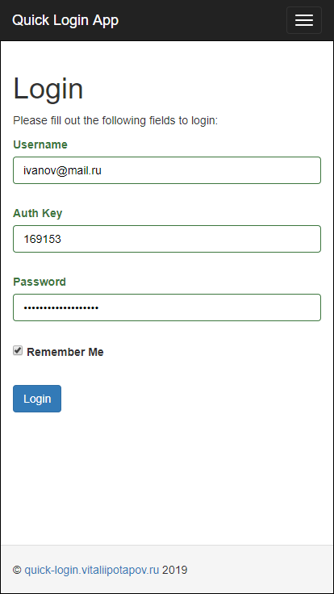
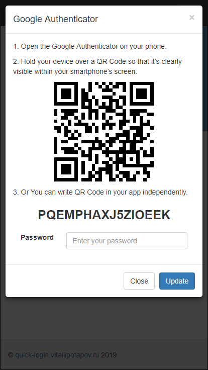
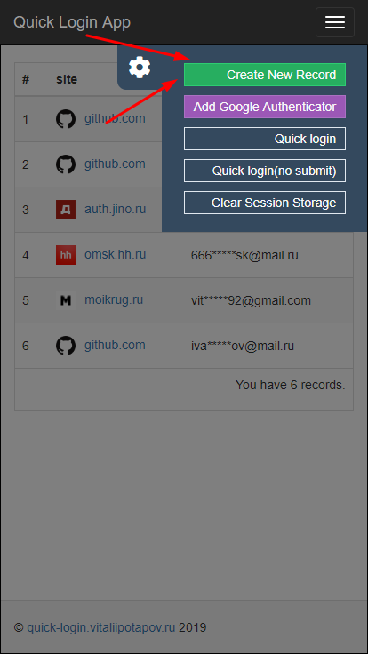
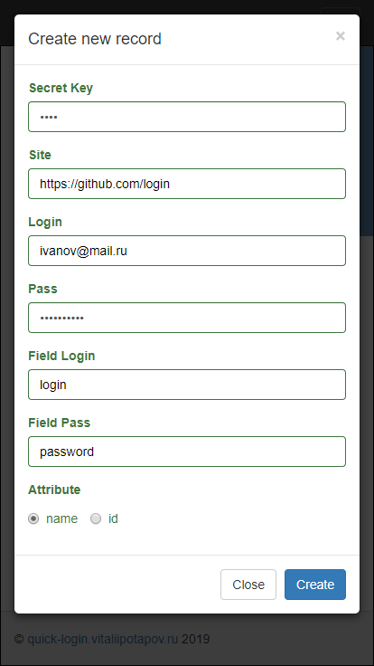
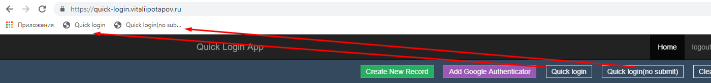
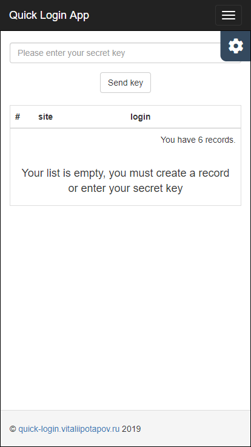
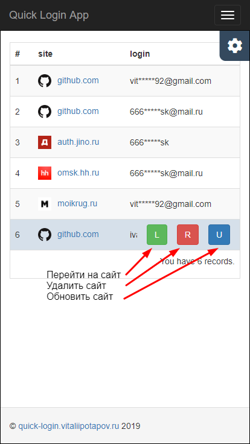
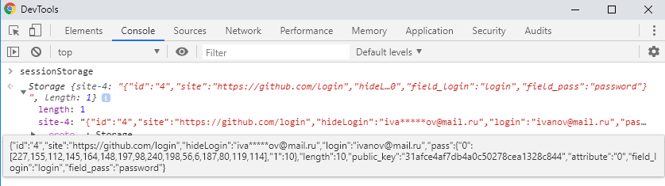
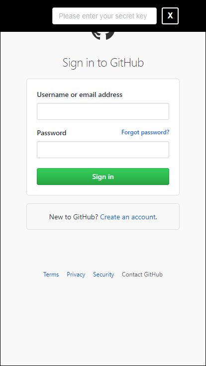
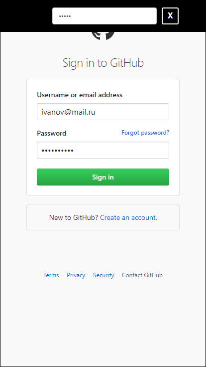

# Quick Login

* © quick-login.vitaliipotapov.ru, 2019
* Author: Vitalii Potapov

**Quick Login:** Сервис для хранения аккаунтов, с последующим быстрым логированием на них.

**Адрес сайта:**  [quick-login.vitaliipotapov.ru](http://quick-login.vitaliipotapov.ru/ "quick-login.vitaliipotapov.ru")

#### Стек технологий:

* **Languages** - JavaScript, PHP, HTML, CSS, SQL
* **Framework** - Yii2
* **Other** - jQuery, MySQL, AJAX, Bootstrap

#### Usages:

**Шаг 1.** Залогинится на сайте

**Шаг 2.** Добавить сайт 

**Шаг 3.** Перетащить кнопку  из хедера на панель закладок (bookmarks)

**Шаг 4.** Перейти на нужный сайт кликнув по зеленой кнопке 

**Шаг 5.** Нажать на кнопку **"Quick login"** добавленную в закладки, в появившемся окне ввести ваш **"Secret Key"** нажать **Enter** либо убрать фокус с поля

**Примечание.** Скрипт автоматически заполнил логин, пароль, и нажмет кнопку входа (в хедере есть кнопка без автоматического входа, она просто пропишет логин и пароль, а вам останется только нажать на кнопку "войти")


#### Демка


--------

## Step by step:

### Шаг 1. Залогинится на сайте:

* Стандартная форма логирования yii2

* После успешной авторизации можно добавить двухфакторную аутентификацию google




### Шаг 2. Добавить сайт :

**Описание полей:**

* **Secret Key:** необходимо ввести ключ для быстрого логирования, ключевое поле по которому будет происходить все последующие шифрование и дешифрование данных
* **Site:** указывается путь на форму логирования
* **Login:** ваш логин на сайте
* **Pass**: ваш пароль на сайте
* **Field Login:** поле формы логина на сайте
* **Field Pass:** поле формы пароля на сайте
* **Attribute:** на выбор два чека "name" и "id" по какому атрибуту будет поиск // document.querySelector('[name=login]') or document.querySelector('#login')

**Пример заполненной формы**:
```html
Secret Key:	5497
Site:		https://github.com/login
Login:		ivanov@mail.ru
Pass:		123IVAN123
Field Login:	login
Field Pass:	password
Attribute:	name(checked)
```

Перед записью в бд поля **Site**, **Login**, **Pass**, шифруются, поле **Secret Key** нигде не хранится его знает только User, оно служит вспомогательным полем при создание ключей, **Site** и **Login** шифруется по формуле:

```php
Ключ_шифрования = 'A' + Secret_Key + strtotime(date_create) // A54971558731832
Сайт_в_бд  = base64_encode(Yii::$app->getSecurity()->encryptByPassword(Сайт, Ключ_шифрования)); // w4YDIjrgXugdZVcSn7lxIzRhNTNhOTU3YzhlYjk5ZTI4MjQxZTg3NjEzN2E0ZDFkYzQ5M2QyZTdlY2I3OWY1YmU2Zjk1YjZlYWY2YTNkN2TY/YhPFQSD7J2jJoEltr/jpMGgywYa1TpZhMnFNIQkqY9ihOztKMMcUoQ0CcwAbJs=
Логин_в_бд = base64_encode(Yii::$app->getSecurity()->encryptByPassword(Логин, Ключ_шифрования)); // kY3acnzv6BvNdLkFfY4SzzA2YTc3NTRhYWM3MmVlYTNiMDExZWY4NzY3OTJkYWE2MjRjZWY2NWU1MDRmYjlkMzhmMzYyY2E0ZjMzZjJmMmTe9tGU4xO5Fc6d9kOhHF1cmyiBQeMX0oXrGw1x9Ip2vw==
```

Поле **Pass** шифруется по формуле:

```php
Публичный_код_в_бд = 'случайная строка ([a-zA-Z0-9]) длиной в 32 символа'; // 31afce4af7db4a0c50278cea1328c844
Приватный_ключ = crop( Secret_Key + Публичный_код ), 0, 32); // 549731afce4af7db4a0c50278cea1328
Пароль_AES = AES_Encrypt(Пароль, Приватный_ключ); // [227,155,112,145,164,148,197,98,240,198,56,6,187,80,119,114]
Пароль_в_бд = base64_encode(Yii::$app->getSecurity()->encryptByPassword(Пароль_AES, Ключ_шифрования)); // pV60uWUCsGhqqjyNQCH+WzBiNWJjZTIzYzc1ZTIwMDY2MzUzODdmMGU2YjFlMjIyMjU0N2U3NjdlZThkN2MxZDU3ZGY0MTkxMTVmZjIwMTXy7IVj9dt6yMEuvp9qNqV5lRfwPVvoFLO9wt49X36mDohUeJJ6psk1e18+XPdJ4qGathYOrb1aK5suwe8d8Ptv25vcP+M+hI8Rvk9lNFGZoomMWtD/D4FIXrlDbxuxd18=
```




### Шаг 3. Перетащить кнопку  из хедера на панель закладок (bookmarks):

Вы можете перенести кнопки "Quick login", "Quick login(no submit)" на панель закладок после чего переименовать их для экономия места.



### Шаг 4. Перейти на нужный сайт кликнув по зеленой кнопке :

Все сайты хранятся в Session Storage после того как вы закроете вкладу, или нажмете на кнопку "Clear Session Storage" хранилище очистится и необходимо будет опять ввести ваш **"Secret Key"** который вы писали на **"Шаге 2"** для того чтоб  дешифровать полученные записи с бд.




Пример того как выглядит запись сайта в Session Storage




### Шаг 5. Нажать на кнопку **"Quick login"** добавленную в закладки...

Перейдя на нужный сайт все необходимые данные для успешного логирования были переданы GET параметрами

Пример url-a:

    https://github.com/login?name=ivanov@mail.ru&pass=227,155,112,145,164,148,197,98,240,198,56,6,187,80,119,114&pkey=31afce4af7db4a0c50278cea1328c844&l=10&attr=0,login,password

Остается его только распарсить и дешифровать пароль с помощью вашего **"Secret Key"** который необходимо будет ввести в появившиеся окно, затем нажать **Enter** либо убрать фокус с поля, и автоматически пропишутся значения логин и пароль

Исходный код кнопки вы можете посмотреть перейдя по этой ссылке [quick-login.js](https://github.com/vitalii-potapov/quick-login.vitaliipotapov.ru/blob/master/web/js/quick-login.js "quick-login.js")




## ToDo:

Думал по пунктам расписать что осталось, но понял что всю доску с Trello переписывать сюда не хочется :), задач много и код причесать, и повторяющиеся куски кода убрать, но вкратце перечислю основные:

1. ~~Google Authenticator~~
2. ~~AES шифрование~~
3. ~~Мобильный интерфейс~~
4. Журнал с логами
5. Белый список ip и устройств пользователя
6. Подтверждение почты
7. Убрать пункты field_login, field_pass, attribute из формы
8. Возможность отправить на почту распечатку сайтов
9. Уведомление на почту при входе в аккаунт

## Новые функции которых нет в описании:

1. Скопировать пароль в буфер

## Notes:

Пока что регистрация закрыта, но если вам понравилось и вы хотите протестировать сервис, вы можете со мной связаться по почте vitalii.potapov92@gmail.com
